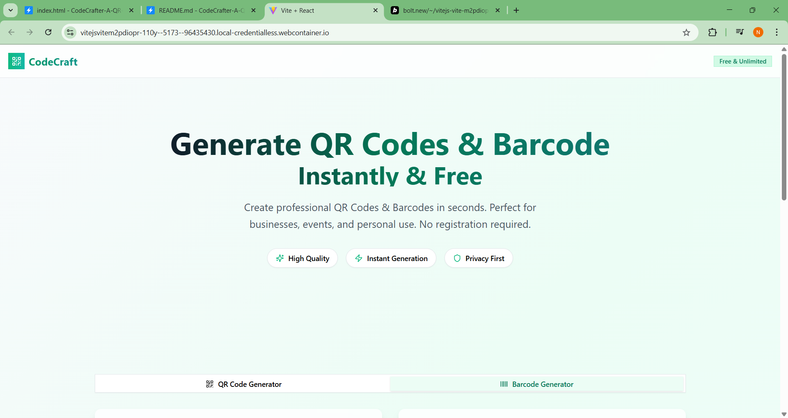

# CodeCraft - QR Code & Barcode Generator

A modern, fast, and user-friendly web application for generating high-quality QR codes and barcodes instantly. Built with React, TypeScript, and Tailwind CSS.



## ✨ Features

### QR Code Generator
- **Multiple Content Types**: Text, URLs, Email, Phone, SMS, WiFi networks
- **Real-time Preview**: See your QR code update instantly as you type
- **High Quality Output**: Professional-grade QR codes ready for print
- **Smart Formatting**: Automatic URL and contact formatting

### Barcode Generator
- **Multiple Formats**: CODE128, CODE39, EAN13, EAN8, UPC, ITF14
- **Customizable**: Adjustable width, height, and display options
- **Validation**: Built-in format validation for different barcode types
- **Professional Output**: Clean, scannable barcodes

### User Experience
- 🚀 **Lightning Fast**: Instant generation with real-time preview
- 📱 **Mobile Optimized**: Perfect experience on all devices
- 🔒 **Privacy First**: All processing happens locally in your browser
- 🎨 **Modern Design**: Clean, intuitive interface with smooth animations
- 💾 **Easy Download**: One-click PNG download for all generated codes

## 🛠️ Tech Stack

- **Frontend**: React 19, TypeScript
- **Styling**: Tailwind CSS, shadcn/ui components
- **QR Generation**: qrcode library
- **Barcode Generation**: jsbarcode library
- **Build Tool**: Vite
- **Icons**: Lucide React

## 🚀 Getting Started

### Prerequisites
- Node.js (version 16 or higher)
- npm or yarn

### Installation

1. Clone the repository:
```bash
git clone https://github.com/yourusername/codecraft.git
cd codecraft
```

2. Install dependencies:
```bash
npm install
```

3. Start the development server:
```bash
npm run dev
```

4. Open your browser and navigate to `http://localhost:5173`

### Building for Production

```bash
npm run build
```

The built files will be in the `dist` directory.

## 📖 Usage

### QR Code Generation

1. Select the **QR Code Generator** tab
2. Choose your content type (Text, URL, Email, etc.)
3. Enter your content in the input field
4. Watch the QR code generate in real-time
5. Click **Download QR Code** to save as PNG

### Barcode Generation

1. Select the **Barcode Generator** tab
2. Choose your barcode format (CODE128, EAN13, etc.)
3. Enter your data (follow format requirements)
4. Preview the generated barcode
5. Click **Download Barcode** to save as PNG

## 🎯 Supported Formats

### QR Code Types
- **Plain Text**: Any text content
- **Website URL**: Automatically formats URLs
- **Email Address**: Creates mailto links
- **Phone Number**: Creates tel links
- **SMS Message**: Creates SMS links
- **WiFi Network**: Generates WiFi connection QR codes

### Barcode Formats
- **CODE128**: Alphanumeric, most versatile
- **CODE39**: Alphanumeric, widely supported
- **EAN13**: 13-digit product codes
- **EAN8**: 8-digit product codes
- **UPC**: Universal Product Code
- **ITF14**: 14-digit shipping container codes

## 🔧 Configuration

The application uses several configuration files:

- `tailwind.config.js`: Tailwind CSS configuration
- `vite.config.js`: Vite build configuration
- `tsconfig.json`: TypeScript configuration
- `components.json`: shadcn/ui component configuration

## 📁 Project Structure

```
src/
├── components/
│   └── ui/              # shadcn/ui components
├── lib/
│   └── utils.ts         # Utility functions
├── App.tsx              # Main app component
├── page.tsx             # Main generator component
├── main.tsx             # App entry point
└── index.css            # Global styles
```

## 🤝 Contributing

Contributions are welcome! Please feel free to submit a Pull Request. For major changes, please open an issue first to discuss what you would like to change.

### Development Guidelines

1. Follow the existing code style
2. Add TypeScript types for new features
3. Test your changes thoroughly
4. Update documentation as needed

## 📄 License

This project is licensed under the MIT License - see the [LICENSE](LICENSE) file for details.

## 👨‍💻 Author

**Nishant Sinha**
- Made with ❤️ for creators worldwide

## 🙏 Acknowledgments

- [qrcode](https://github.com/soldair/node-qrcode) - QR code generation
- [jsbarcode](https://github.com/lindell/JsBarcode) - Barcode generation
- [shadcn/ui](https://ui.shadcn.com/) - UI components
- [Tailwind CSS](https://tailwindcss.com/) - Styling
- [Lucide](https://lucide.dev/) - Icons

## 🐛 Bug Reports & Feature Requests

If you encounter any bugs or have feature requests, please create an issue on GitHub with:
- Clear description of the problem/feature
- Steps to reproduce (for bugs)
- Expected vs actual behavior
- Screenshots if applicable

## 📊 Performance

- **Bundle Size**: Optimized for fast loading
- **Generation Speed**: Instant QR code and barcode generation
- **Browser Support**: Modern browsers (Chrome, Firefox, Safari, Edge)
- **Mobile Performance**: Optimized for mobile devices

---

**CodeCraft** - Generate professional QR codes and barcodes instantly, for free! 🚀